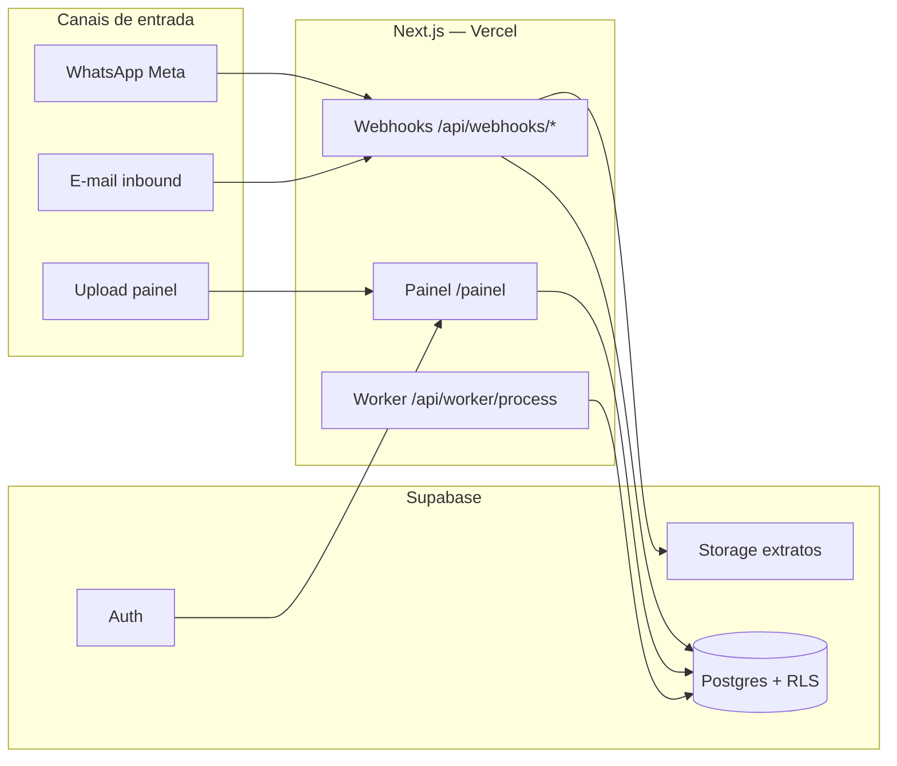
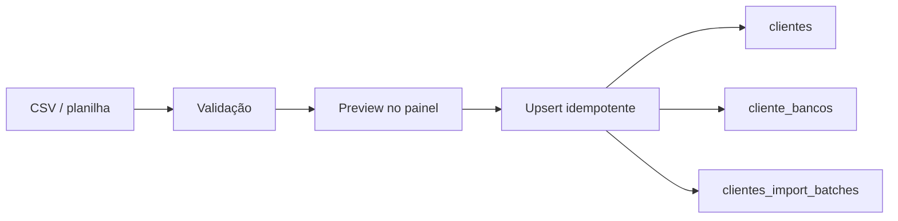
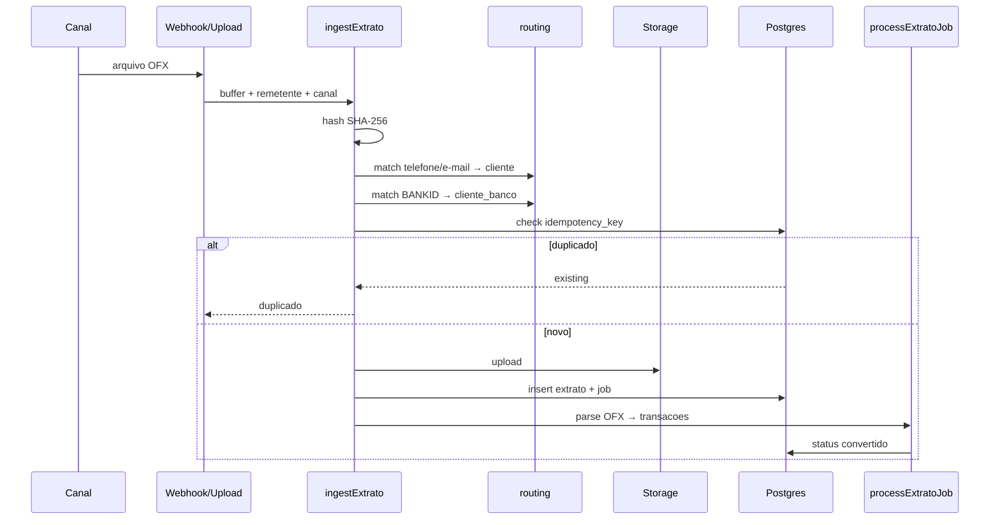

# Spec de arquitetura — Extrato Pronto (piloto E2)

> **Status:** validada em jun/2026 · Etapa 1 parcialmente implementada em `web/` + `supabase/`.
> **Referências:** `docs/plano-piloto.md` · `docs/piloto/protocolo-lgpd-piloto.md` · implementação `web/src/lib/pipeline/`.

Este documento fecha as decisões que estavam “a confirmar na spec” (`CLAUDE.md`) e registra o que já está no código, o que falta e o que precisa ajuste antes de escalar.

---

## 1. Visão geral

Produto B2B2C: escritório contábil (tenant) orquestra recepção → conversão → exportação de extratos dos clientes finais (CNPJs).



**Princípio:** webhooks escrevem via `service_role` (server-only); painel lê via `authenticated` + RLS. Nunca expor `service_role` no browser.

---

## 2. Stack — decisões validadas

| Camada | Decisão | Alternativa descartada | Motivo |
|--------|---------|------------------------|--------|
| Painel + API | **Next.js 16 App Router** (`web/`) | SPA separada | SSR, route handlers, deploy Vercel, uma codebase |
| Hosting | **Vercel** (app) + **Supabase Cloud** (dados) | Fly.io, Railway | Alinhado ao plano; DX rápida no piloto |
| Banco | **Supabase Postgres** | Neon standalone | RLS nativo, Auth, Storage integrados |
| Auth painel | **Supabase Auth** (e-mail/senha no piloto) | Clerk | Menos vendors; tenant via `escritorio_membros` |
| Arquivos | **Supabase Storage** bucket `extratos` (privado) | S3 direto | Mesmo tenant boundary; path `{escritorio_id}/{extrato_id}/` |
| Fila Etapa 1 | **`pipeline_jobs` + processamento inline** no ingest | Inngest já | Menos infra no piloto; worker HTTP para retry |
| Fila Etapa 4+ | **Migrar para async** (Vercel Cron → `/api/worker/process` ou Supabase Queues) | — | Régua + PDF não podem bloquear webhook Meta |
| WhatsApp | **Meta Cloud API** direta | BSP terceiro | Controle templates utility; plano §2 |
| E-mail inbound | **Webhook genérico** (`POST /api/webhooks/email`) | — | Contrato estável; plugar Resend/Postmark depois |
| OFX | **Parser determinístico** (`fast-xml-parser`) | LLM | Reprodutível, barato, eval ≥ 95% |
| PDF | **Claude visão** (Etapa 2b) | — | Fora do escopo Etapa 1 |
| Export contábil | **CSV Alterdata** (Etapa 2a) | API Alterdata | Plano valida import manual na Etapa 0 |

---

## 3. Modelo de dados

### 3.1 Entidades (implementadas)

```
escritorios ─┬─ escritorio_membros ─── auth.users
             ├─ clientes ─── cliente_bancos
             ├─ clientes_import_batches
             ├─ competencias
             └─ extratos ─┬─ transacoes
                            └─ pipeline_jobs
```

| Tabela | Responsabilidade |
|--------|------------------|
| `escritorios` | Tenant; `slug` para roteamento; `email_inbound` (futuro) |
| `escritorio_membros` | Quem acessa o painel; base do RLS |
| `clientes` | CNPJ, contato (telefone/e-mail) para match de remetente |
| `cliente_bancos` | Bancos esperados por cliente |
| `clientes_import_batches` | Histórico de imports CSV (auditoria operacional) |
| `competencias` | Mês contábil por escritório (`ano`, `mes`) |
| `extratos` | Arquivo recebido + status + idempotência |
| `transacoes` | Linhas convertidas (OFX hoje; PDF depois) |
| `pipeline_jobs` | Fila de processamento |

### 3.2 Entidades planejadas (ainda não no schema)

| Tabela | Etapa | Uso |
|--------|-------|-----|
| `checklist_pendencias` | 3–4 | Cliente × banco × competência: falta / recebido / exportado |
| `exportacoes` | 2a | Arquivo Alterdata gerado + status import |
| `triagem_resolucoes` | 2b–3 | Histórico de correção manual (opcional; pode ser campos em `extratos`) |
| `audit_events` | contínuo | LGPD: quem acessou/exportou (sem conteúdo de extrato) |
| `bancos` (catálogo) | 1-fix | Mapear `BANKID` OFX (ex.: `341`) → `banco_codigo` (`itau`) |

### 3.3 Status de extrato

| Status | Significado |
|--------|-------------|
| `recebido` | Arquivo persistido, aguardando processamento |
| `processando` | Worker convertendo |
| `convertido` | Transações extraídas |
| `duplicado` | Idempotência — reenvio ignorado |
| `triagem` | Remetente/banco não identificado ou PDF pendente 2b |
| `erro` | Falha de parse/processamento |

**Futuro (Etapa 2a+):** `exportado` como status ou FK em `exportacoes`.

---

## 3.4 Cadastro de clientes (ImportJob)

Escritórios já têm cadastro no Alterdata/planilha — **cadastro manual um a um é anti-padrão no piloto**.

### Estratégia por fase

| Fase | Mecanismo |
|------|-----------|
| Kick-off E2 | White-glove: import CSV da planilha deles (5–10 clientes) |
| Painel (implementado) | Self-service: upload CSV → preview → confirmar |
| Runtime (complemento) | Triagem enriquece cliente/banco no 1º extrato |
| Escala 30–100 CNPJs | Adapter export cadastro Alterdata (futuro) |
| Régua (Etapa 4) | Checklist mensal **separado** do cadastro mestre |

### Fluxo ImportJob



**Template:** `web/public/template-import-clientes.csv` · doc operacional: `docs/piloto/import-clientes.md`

### Formato CSV

Uma linha = um **banco** do cliente (CNPJ repetido para múltiplos bancos):

```csv
cnpj,razao_social,telefone,email,banco_codigo,banco_nome,conta_ref
```

| Coluna | Obrigatório |
|--------|-------------|
| `cnpj`, `razao_social` | sim |
| `telefone`, `email` | recomendado (roteamento) |
| `banco_*`, `conta_ref` | opcional por linha |

### Upsert idempotente

| Entidade | Chave única | Reimport |
|----------|-------------|----------|
| Cliente | `(escritorio_id, cnpj)` | Atualiza razão social, tel, e-mail |
| Banco | `(cliente_id, banco_codigo, conta_ref)` | Atualiza `banco_nome` |

### Implementação

| Peça | Caminho |
|------|---------|
| Parser + validação | `web/src/lib/import/clientes-csv.ts` |
| Apply + batch log | `web/src/lib/import/apply-clientes.ts` |
| UI painel | `web/src/app/painel/import-clientes-form.tsx` |
| Migration | `supabase/migrations/20260612000000_clientes_import.sql` |

### Cadastro lazy (triagem)

Quando remetente não identificado, extrato vai para `status=triagem`. Resolver no painel (Etapa 3) **cria/atualiza** `clientes` — complementa o CSV, não substitui.

---

## 4. Pipeline de ingestão



### 4.1 Idempotência (regra inviolável)

```
idempotency_key = hash(arquivo) : CNPJ : banco_codigo : YYYY-MM
unique (escritorio_id, idempotency_key)
```

**Validado** contra `docs/plano-piloto.md` e `CLAUDE.md`.

**Risco conhecido:** extratos em triagem usam `CNPJ=desconhecido` — reenvios do mesmo arquivo colidem. **Correção planejada:** chave de triagem = `hash:remetente:competencia` até CNPJ ser resolvido.

### 4.2 Inferência de competência

Ordem: (1) campo explícito no upload → (2) `DTEND` do OFX → (3) última transação → (4) mês corrente.

Alinhado ao calendário de competência do piloto (jul/2026).

---

## 5. Roteamento multi-tenant (plano §2.2)

| Passo | Plano | Implementação | Status |
|-------|-------|---------------|--------|
| 1. Cadastro prévio tel/e-mail ↔ CNPJ ↔ bancos | Sim | `clientes` + `cliente_bancos` + seed E2 | ✅ |
| 2. Match automático remetente | Sim | `matchClienteByRemetente` — exige match **único** | ✅ parcial |
| 2b. Inferir banco por pendência checklist | Sim | Não implementado | ❌ Etapa 3–4 |
| 3. Confirmação WhatsApp “confirma?” | Sim | Não implementado | ❌ Etapa 3 |
| 4. Fallback triagem manual | Sim | `status=triagem`; painel lista mas **sem fila de resolução** | 🟡 |
| 5. Isolamento RLS | Sim | RLS em todas as tabelas + storage prefix | ✅ |

### WhatsApp número compartilhado

**Piloto E2 only (agora):** webhooks usam `DEFAULT_ESCRITORIO_SLUG=e2-piloto`. Aceitável enquanto só E2.

**Antes de E3/E4:** resolver escritório por:
1. Match global tel/e-mail → cliente → `escritorio_id` (telefone único entre escritórios no piloto), **ou**
2. Campo `to` no e-mail inbound (`escritorio.email_inbound`), **ou**
3. Fila de triagem quando colisão.

---

## 6. Segurança e LGPD

| Regra | Como garantir |
|-------|---------------|
| Nunca persistir senha PDF | Etapa 2b: detectar PDF protegido → pedir reenvio; não armazenar senha |
| Nunca logar conteúdo extrato | Logs só: `extrato_id`, status, counts, erros genéricos |
| Escritório = controlador | Termo + opt-in (`docs/piloto/`) |
| RLS multi-tenant | `get_user_escritorio_ids()` em todas as policies |
| Webhooks autenticados | Meta HMAC, `x-inbound-secret`, `x-worker-secret` |
| Retenção 90 dias pós-piloto | Job futuro; documentado, não automatizado |
| Service role | Apenas server routes / Server Actions admin |

**Gap:** tabela `audit_events` e política de delete-on-request não implementadas — **antes de produção com dados reais E2**.

---

## 7. Canais

### 7.1 WhatsApp (`/api/webhooks/whatsapp`)

- GET: verificação Meta (`WHATSAPP_VERIFY_TOKEN`)
- POST: download mídia documento → `ingestExtrato(canal=whatsapp)`
- **Etapa 1:** só documentos; texto ignorado
- **Etapa 3:** template confirmação + régua (Etapa 4)

### 7.2 E-mail (`/api/webhooks/email`)

Contrato piloto (estável para trocar provider):

```json
{
  "from": "cliente@example.com",
  "escritorio_slug": "e2-piloto",
  "attachments": [{ "filename": "extrato.ofx", "content_base64": "..." }]
}
```

Header: `x-inbound-secret`.

**Produção recomendada:** Resend Inbound ou Postmark → transformar para este contrato.

### 7.3 Upload painel

Server Action autenticada; `cliente_id` + `banco_codigo` explícitos — **útil para demo E2** sem Meta configurada.

---

## 8. Painel (Etapa 1 vs plano §2 escopo 6)

| Feature plano | Etapa 1 |
|---------------|---------|
| Matriz cliente × banco × competência | 🟡 Matriz simplificada; sem “exportado” |
| Status chegou / falta / convertido / exportado / triagem | 🟡 Falta exportado; triagem sem ação |
| Fila de triagem | ❌ Etapa 3 |
| Cadastro clientes/bancos | ✅ Import CSV + upsert; doc `docs/piloto/import-clientes.md` |

---

## 9. Validação contra Etapa 1 (critério de pronto)

| Critério plano | Arquitetura | Código |
|----------------|-------------|--------|
| Webhook Meta | ✅ spec §7.1 | ✅ route existe |
| Inbox e-mail | ✅ spec §7.2 | ✅ route genérica |
| Fila + worker | ✅ `pipeline_jobs` | ✅ inline + `/api/worker/process` |
| Schema + RLS | ✅ §3 | ✅ migration |
| Parser OFX | ✅ §4 | ✅ `lib/ofx/parse.ts` |
| Idempotência hash+competência | ✅ §4.1 | ✅ unique constraint |
| OFX no zap **ou** e-mail classificado | ✅ | 🟡 demo via upload OK |
| Reenvio duplicado ignorado | ✅ | ✅ |

**Veredito Etapa 1:** arquitetura **aprovada para continuar**, com gaps documentados abaixo.

---

## 10. Gaps e correções priorizadas

### P0 — antes de demo real E2 (dados reais)

| # | Gap | Status |
|---|-----|--------|
| 1 | BANKID OFX → `banco_codigo` | ✅ `bancos` + `resolveBancoCodigo` |
| 2 | PDF sem persistir | ✅ PDF → `status=triagem` + storage |
| 3 | Idempotência triagem | ✅ `triagem:hash:scope:competencia` |
| 4 | Deploy Vercel + Supabase cloud | ⬜ pendente |

### P1 — Etapa 2a (Alterdata)

| # | Gap | Status |
|---|-----|--------|
| 5 | Tabela `exportacoes` | ✅ migration + download `/api/export/[id]` |
| 6 | Layout Alterdata E2 | 🟡 CSV v1 provisório — validar com E2 |
| 7 | Processamento async | ⬜ antes de volume / régua |

### P2 — antes Etapa 3–4

| # | Gap | Ação |
|---|-----|------|
| 8 | `checklist_pendencias` | Schema + rollover mensal |
| 9 | Confirmação WhatsApp | Template Meta + state machine |
| 10 | Fila triagem no painel | UI resolver cliente/banco |
| 11 | `audit_events` | LGPD produção |

---

## 11. Roadmap técnico alinhado ao plano

```
Etapa 1            espinha dorsal          ✅ (P0 código fechado)
Etapa 2a           export Alterdata        🟡 CSV v1 — validar import E2
Etapa 2b           PDF + Claude + triagem  ← próximo produto
Etapa 3            painel completo + triagem
Etapa 4            régua + checklist
Etapa 5            fechamento competência E2
Deploy             Vercel + Supabase       ← próximo infra
```

**Ordem mantida do plano:** export antes da régua.

---

## 12. Ambientes e configuração

| Variável | Uso |
|----------|-----|
| `NEXT_PUBLIC_SUPABASE_URL` | Client + server |
| `NEXT_PUBLIC_SUPABASE_ANON_KEY` | Browser / RLS |
| `SUPABASE_SERVICE_ROLE_KEY` | Webhooks, ingest (server only) |
| `DEFAULT_ESCRITORIO_SLUG` | Piloto E2-only |
| `WHATSAPP_*` | Meta webhook + download mídia |
| `INBOUND_EMAIL_SECRET` | Autenticação webhook e-mail |
| `WORKER_SECRET` | Cron/reprocessamento fila |

Ver `web/.env.example`.

---

## 13. Decisões registradas (ADR resumido)

| Data | Decisão | Consequência |
|------|---------|--------------|
| jun/2026 | Monorepo leve: `web/` + `supabase/` na raiz | Docs permanecem em `docs/` |
| jun/2026 | Fila Postgres, não Redis | Suficiente para piloto; revisar em 100+ extratos/dia |
| jun/2026 | E2-only via slug fixo no webhook | Remover antes de E3 |
| jun/2026 | Upload manual no painel | Aceito como canal de validação |
| jun/2026 | Cadastro via CSV ImportJob, não CRUD manual | `clientes_import_batches` + painel |

---

## 14. Próximo passo recomendado

1. **`supabase db reset`** — migrations `bancos`, `exportacoes`
2. **Demo E2** — import clientes → upload OFX → export CSV → import no Alterdata
3. **Ajustar layout CSV** conforme feedback E2 (`field-mapping.md`)
4. **Deploy** Vercel + Supabase cloud
5. **Etapa 2b** — PDF + Claude

---

## Changelog

| Data | Mudança |
|------|---------|
| jun/2026 | Spec validada pós-Etapa 1; gaps e decisões de stack fechadas |
